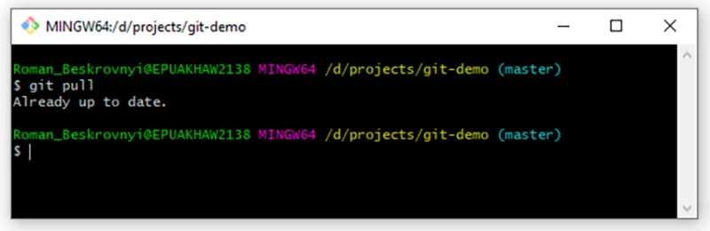

# Работа с удаленными репозиториями

**Последний шаг** — разобраться еще с несколькими командами, которые нужны для работы с удаленным репозиторием. 

Как я уже говорил, удаленный репозиторий — это какое-то место, где хранится репозиторий и откуда можно его клонировать.

Какие бывают удаленные репозитории? Примеров тьма:
- [GitHub](https://github.com/) — это крупнейшее хранилище для репозиториев и совместной разработки.
- [GitLab](https://about.gitlab.com/) - веб-инструмент жизненного цикла [DevOps](https://ru.wikipedia.org/wiki/DevOps) с [открытым исходным кодом](https://ru.wikipedia.org/wiki/%D0%9E%D1%82%D0%BA%D1%80%D1%8B%D1%82%D0%BE%D0%B5_%D0%9F%D0%9E), представляющий систему управления [репозиториями](https://ru.wikipedia.org/wiki/%D0%A0%D0%B5%D0%BF%D0%BE%D0%B7%D0%B8%D1%82%D0%BE%D1%80%D0%B8%D0%B9) кода для [Git](https://ru.wikipedia.org/wiki/Git) с собственной вики, [системой отслеживания ошибок](https://ru.wikipedia.org/wiki/%D0%A1%D0%B8%D1%81%D1%82%D0%B5%D0%BC%D0%B0_%D0%BE%D1%82%D1%81%D0%BB%D0%B5%D0%B6%D0%B8%D0%B2%D0%B0%D0%BD%D0%B8%D1%8F_%D0%BE%D1%88%D0%B8%D0%B1%D0%BE%D0%BA), CI/CD пайплайн и другими функциями.После новости о том, что Microsoft купила GitHub, некоторые разработчики продублировали свои наработки в GitLab.
- BitBucket — веб-сервис для хостинга проектов и их совместной разработки, основанный на системе контроля версий Mercurial и Git. Одно время имел большое преимущество перед GitHub в том, что у него были бесплатные приватные репозитории. В прошлом году GitHub также открыл эту возможность для всех бесплатно.
- И так далее…

Первое, что нужно сделать в работе с удаленным репозиторием — клонировать проект себе в локальный. 

Для этого дела я экспортировал проект, который мы делали локально, и теперь каждый его может себе клонировать, написав:

    git clone https://github.com/KarmaevVl/Skillfactory

Теперь локально есть полная копия проекта. Чтобы быть уверенным, что локально находится последняя копия проекта, нужно, как говорится, спулить данные, написав:

    git pull

В нашем случае сейчас ничего не изменилось удаленно, поэтому и ответ: *Already up to date.*

Но если я внесу какие-то изменения в удаленном репозитории, локальный обновится после того, как мы их спулим.

И, наконец, последняя команда — запушить данные на удаленный репозиторий. Когда мы локально что-то сделали и хотим это передать на удаленный репозиторий, нужно сперва создать новый коммит локально. Для этого добавим в наш текстовый файл еще что-нибудь:

Теперь уже обыденная для нас вещь — создаем коммит под это дело:

    git add test_resource.txt
    git commit -m “prepated txt for pushing”

И теперь команда, чтобы отправить это на удаленный репозиторий:

    git push

Вот и все, что я хотел рассказать. Спасибо за внимание.