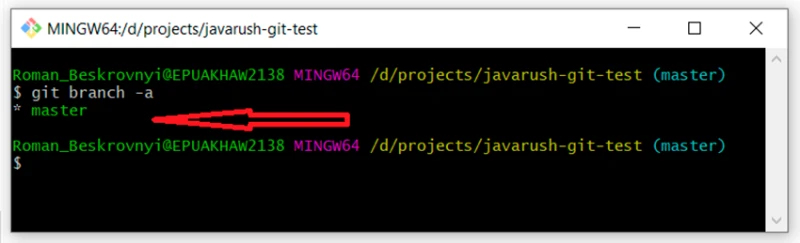
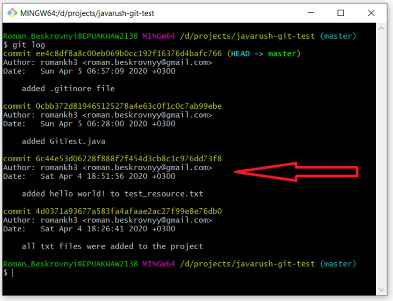
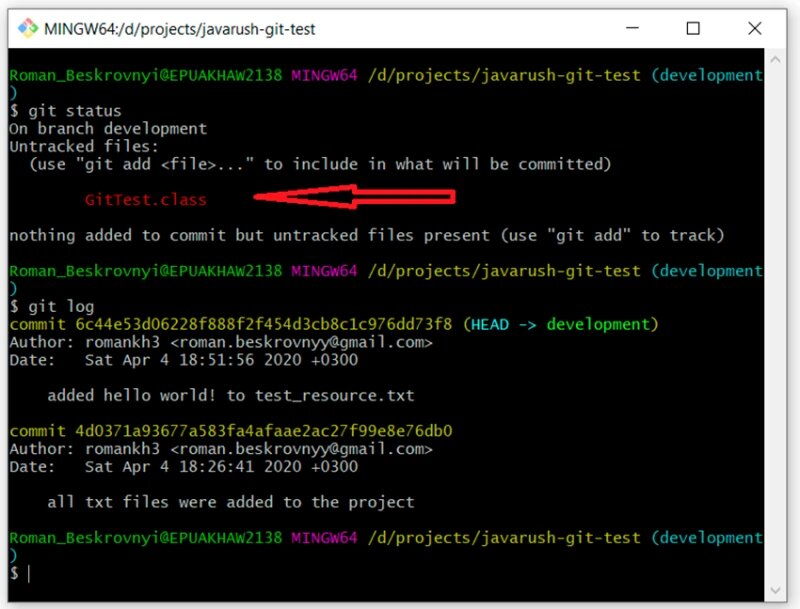
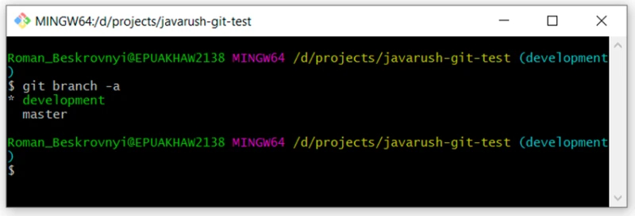
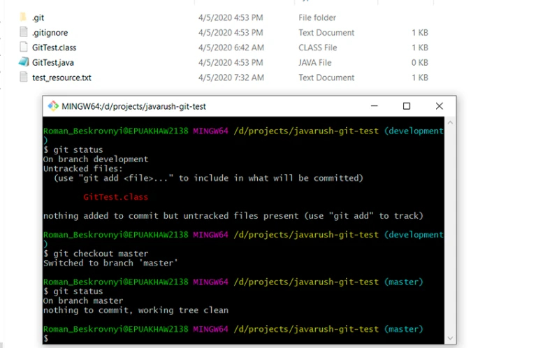
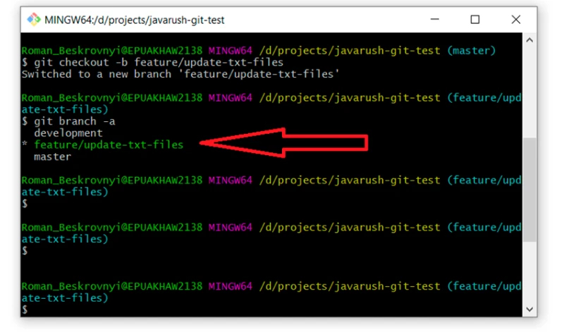

# Работа с ветками

Разумеется, работать в одной ветке неудобно одному и невозможно, когда в команде больше одного человека. Для этого существует ветвление.

Как я уже говорил, ветка — это просто подвижный указатель на коммиты.

В этой части рассмотрим работу в разных ветках: как смерджить изменения одной ветки в другую, какие могут возникнуть конфликты и многое другое.

Чтобы посмотреть список всех веток в репозитории и понять, на какой находишься, нужно написать:

    git branch -a

Видно, что у нас только одна ветка *master*, и звездочка перед ней говорит, что мы находимся на ней. К слову, чтобы узнать, на какой ветке мы находимся, можно воспользоваться и проверкой статуса

    git status

Далее есть несколько вариантов создания веток
- создать новую ветку на основе той, на которой находимся (99% случаев);
- создать ветку на основе конкретного коммита (1%).

## Создаем ветку на основе конкретного коммита

Опираться будем на уникальный идентификатор коммита. Чтобы найти его, напишем:

    git log

Я выделил коммит с комментарием “added hello world…”. У него уникальный идентификатор — “6c44e53d06228f888f2f454d3cb8c1c976dd73f8”. Я хочу создать ветку development начиная с этого коммита. Для этого напишу:

    git checkout -b development 6c44e53d06228f888f2f454d3cb8c1c976dd73f8

Создается ветка, в которой будут только первые два коммита из ветки *master*. Чтобы проверить это, мы сперва убедимся, что перешли в другую ветку и посмотрим на количество коммитов ней:

    git status
    git log

И правда: получилось, что у нас два коммита. Кстати, интересный момент: в этой ветке еще нет файла .gitignore, поэтому наш скомпилированный файл (GitTest.class) теперь подсвечивается в *untracked* состоянии.

Теперь можем провести еще раз ревизию наших веток, написав:

    git branch -a

Видно, что есть две ветки — *master* и *development*  — и сейчас стоим на *development*.

## Создаем ветку на основе текущей

Второй способ создания ветки — создание на основе другой. Я хочу создать ветку на основе *master* ветки, поэтому нужно сперва перейти на нее, а уже следующим шагом — создать новую. Смотрим:

    git checkout master — переходим на ветку *master*
    git status — проверяем, точно ли на мастере.

Вот здесь видно, что мы перешли на *master* ветку, здесь уже работает гит игнор, и скомпилированный класс уже не светится как *untracked*.

Теперь создаем новую ветку на основе *master* ветки:

    git checkout -b feature/update-txt-files

Если есть сомнения, что эта ветка будет не такой же, как и *master*, можно это легко проверить, написав 

    git log 

и посмотреть на все коммиты. Там их должно быть четыре.