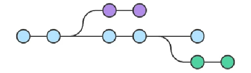

# Что такое ветка

**Ветка** — это указатель какого-то коммита. Так как коммит знает, какой коммит был до него, когда ветка указывает на какой-то коммит, к ней относятся и все те предыдущие. 

Исходя из этого можно сказать, что веток, указывающих на один и тот же коммит, может быть сколько угодно много.

Работа происходит в ветках, поэтому когда создается новый коммит, ветка переносит свой указатель на более новый коммит.

