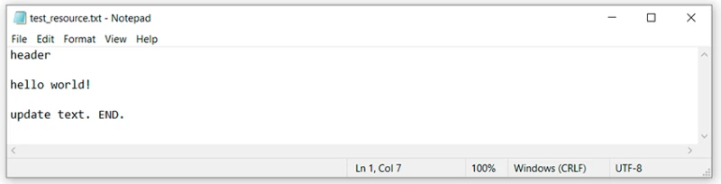

# Конфликты

Прежде чем разобраться с тем, что такое конфликт, нужно поговорить о слиянии (смердживании) одной ветки в другую.

Вот такой картинкой можно показать процесс, когда одну ветку мерджат в другую: 

То есть, есть главная ветка. От нее в какой-то момент создают второстепенную, в которой происходят изменения. Как только работа сделана, нужно слить одну ветку в другую.

Я не буду описывать разные особенности: я хочу донести в рамках этой статьи только понимание, а уже детали узнаете сами, если будет нужно.

Так вот, на нашем примере, мы создали ветку feature/update-txt-files. Как написано в имени ветки — обновим текст.

Теперь нужно создать под это дело новый коммит:

    git add *.txt
    git commit -m “updated txt files”
    git log

Теперь, если мы хотим смерджить feature/update-txt-files ветку в master, нужно перейти в *master* и написать git merge feature/update-txt-files:

    git checkout master
    git merge feature/update-txt-files
    git log

Как результат — теперь и в мастер ветке есть коммит, который был добавлен в feature/update-txt-files.

Эта функциональность добавлена, поэтому можно удалить фиче (feature) ветку. Для этого напишем:

    git branch -D feature/update-txt-files

Усложняем ситуацию: теперь допустим, что опять нужно изменить txt файл. Но теперь еще и в мастере этот файл будет изменен также. То есть он будет параллельно изменяться, и гит не сможет понять что нужно делать в ситуации, когда мы захотим смерджить в master ветку новый код.

Создаем новую ветку на основе *master*, делаем изменения в text_resource.txt и создаем коммит под это дело:

    git checkout -b feature/add-header
    ... делаем изменения в файле

    git add *.txt
    git commit -m “added header to txt”

Переходим на *master* ветку и также обновляем этот текстовый файл в той же строке, что и фиче ветка:

    git checkout master
    … обновили test_resource.txt

    git add test_resource.txt
    git commit -m “added master header to txt”

И теперь самый интересный момент: нужно смерджить изменения из feature/add-header ветки в *master*. Мы находимся в мастер ветке, поэтому нужно только написать:

    git merge feature/add-header

Но мы получим результат с конфликтом в файле test_resource.txt:

И здесь мы можем видеть, что гит не смог самостоятельно решить, как смерджить этот код и говорит, что нужно вначале разрезолвить конфликт, а уже потом сделать коммит.

Ок, открываем в текстовом редакторе файл, в котором конфликт, и видим:

Чтобы понять, что здесь сделал гит, нужно вспомнить, что мы где писали, и сравнить:

>1. между “<<<<<<< HEAD” и “=======” находятся изменения мастер, которые были в этой строке в мастер ветке.
>2. между “=======” и “>>>>>>> feature/add-header” находятся изменения, которые были в feature/add-header ветке.

Таким образом гит показывает, что в этом месте он не смог понять, как слить воедино этот файл, разделил этот участок на две части из разных веток и предложил решить нам самим.

Хорошо, твердою волей решаю убрать все, оставить только слово header:

Посмотрим на статус изменений, описание будет несколько другим. Будет не modified состояние, а Unmerged. Так что смело можно было добавить пятое состояние… Но я думаю, что это излишне, посмотрим:

    git status

Убедились, что это другой случай, необычный. Продолжаем:

    git add *.txt

В описании можно заметить, что предлагают написать только git commit. Слушаем и пишем:

    git commit

И все: таким образом мы сделали это — разрезолвили конфликт в консоли.

Конечно, в средах разработки можно это сделать немного проще, например, в Intellij IDEA все настроено так хорошо, что можно выполнять все необходимые действия в ней. Но среда разработки делает много чего “под капотом”, и мы зачастую не понимаем, что именно там произошло. А когда нет понимания, тогда могут возникнуть и проблемы.