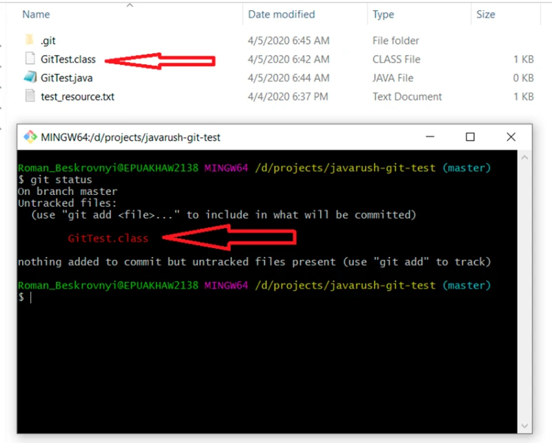
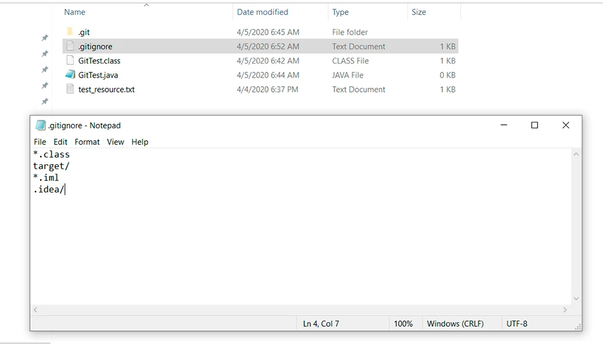
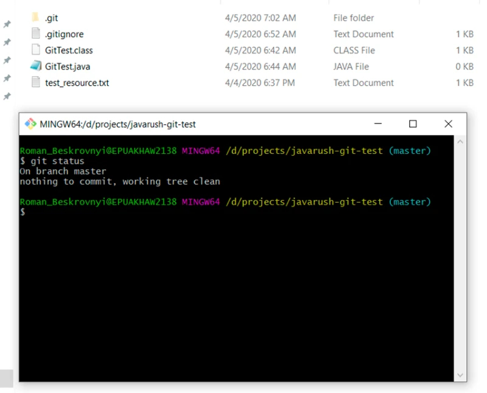

# Работа с .gitignore

Ясно, что мы хотим хранить только исходный код и ничего другого в репозитории. А что может быть еще? Как минимум, скомпилированные классы и/или файлы, которые создают среды разработки. 

Чтобы гит их игнорировал, есть специальный файл, который нужно создать. Делаем это: создаем файл в корне проекта с названием .gitignore, и в этом файле каждая строка будет шаблоном для игнорирования.

В этом примере гит игнор будет выглядеть так:

    ```
    *.class
    target/
    *.iml
    .idea/
    ```

Смотрим теперь:
- первая строка — это игнорирование всех файлов с расширением .class;
- вторая строка — это игнорирование папки target и всего, что она содержит;
- третья строка — это игнорирование всех файлов с расширением .iml;
- четвертая строка — это игнорирование папки .idea.

Попробуем на примере. Чтобы посмотреть как это работает, добавим скомпилированный класс GitTest.class в проект и посмотрим статус проекта:

    git status



Ясно, что мы не хотим как-то случайно (если использовать git add -A) добавить скомпилированный класс в проект. Для этого создаем .gitignore файл и добавляем все, что описывалось ранее:



Теперь добавим новым коммитом гит игнор в проект:

    git add .gitignore
    git commit -m “added .gitignore file”

И теперь момент истины: у нас есть в *untracked* состоянии скомпилированный класс GitTest.class, который мы не хотели добавлять в гит репозиторий. 

Вот здесь-то и должен заработать гит игнор

    git status



Все чисто) Гит игнору +1