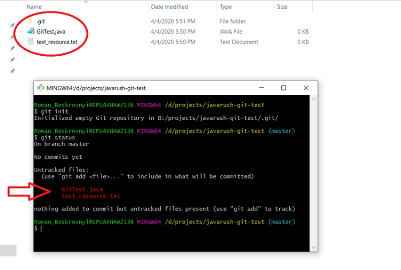
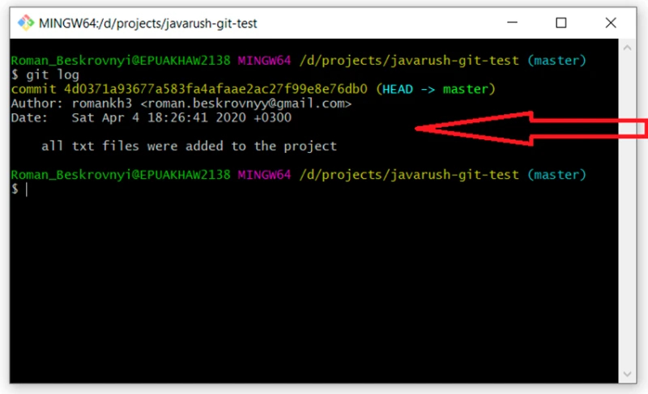
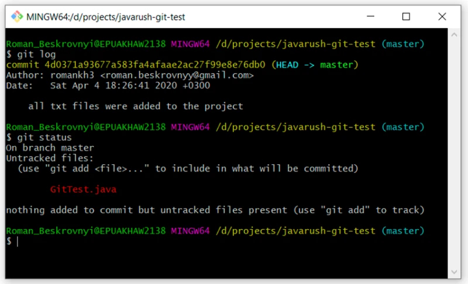
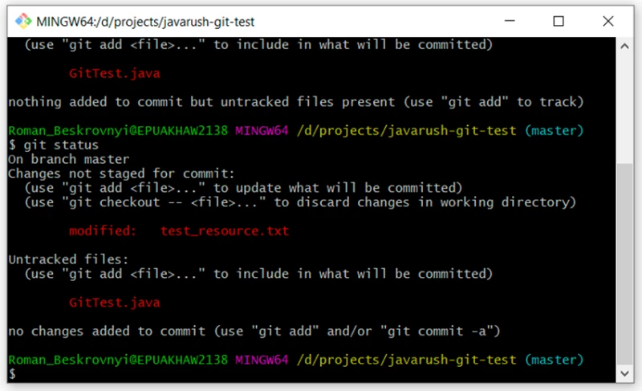
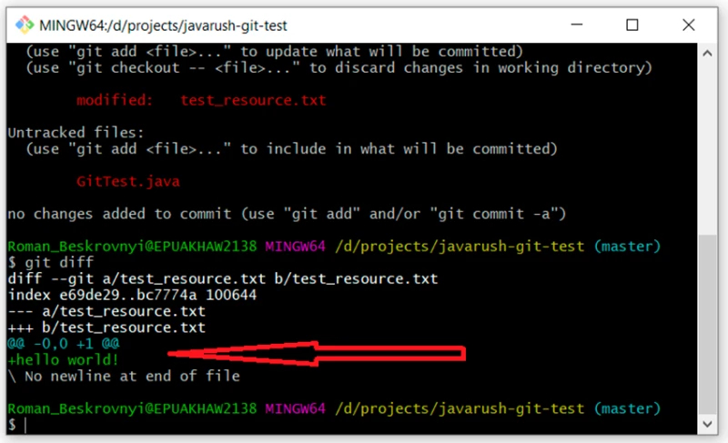
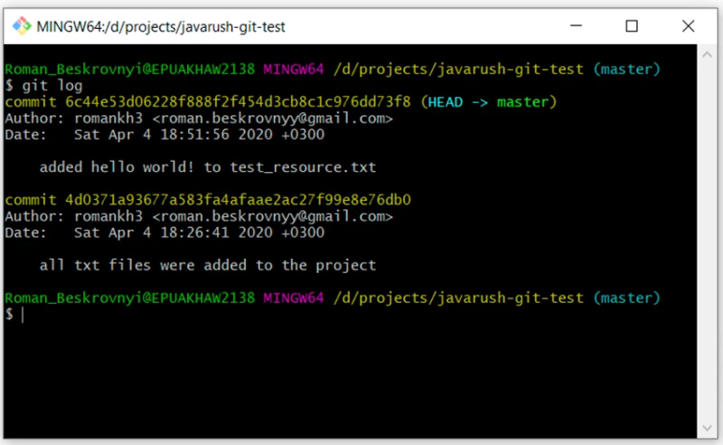
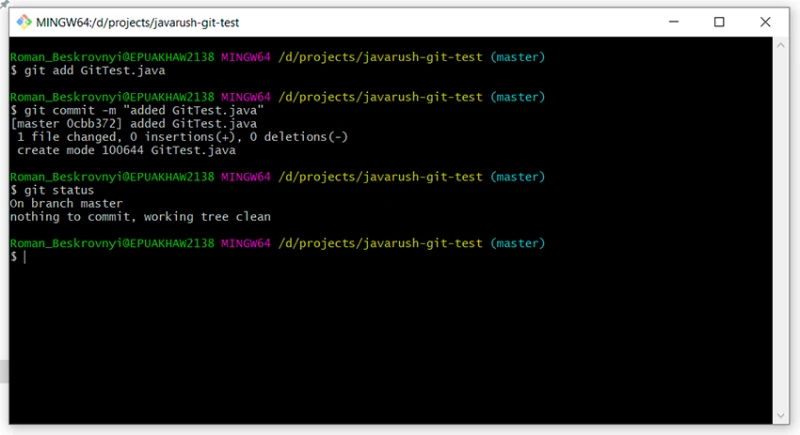

# Работа с гитом в локальном репозитории

Чтобы создать локальный репозиторий, нужно написать:

    git init

После этого будет создана папка .git

> .git — это папка, которая хранит всю информацию о гит репозитории.

Далее, добавляются файлы в этот проект, и их состояние становится *Untracked*. Чтобы посмотреть, какой статус работы на данный момент, пишем:

    git status

Мы находимся в master ветке, и пока мы не перейдем в другую, 
так все и останется.

Таким образом видно, какие файлы изменены, но еще не добавлены в состояние *staged*. Чтобы добавить их в состояние *staged*, нужно написать 

    git add. 

Здесь может быть несколько вариантов, например:

- git add -A — добавить все файлы из состояния в staged;
- git add . — добавить все файлы из этой папки и все внутренних. По сути тоже самое, что и предыдущее;
- git add <имя файла> — добавляет только конкретный файл. Здесь можно пользоваться регулярными выражениями, чтобы добавлять по какому-то шаблону. Например, git add *.java: это значит, что нужно добавить только файлы с расширением java.

Ясно, что первые два варианта простые, а вот с добавлением будет интереснее, поэтому пишем:

    git add *.txt

Чтобы проверить статус, используем уже известную нам команду:

    git status

И, наконец, последний этап (при локальном репозитории, с удаленным будет еще один ;)) — закоммитить и создать новый коммит:

    git commit -m “all txt files were added to the project”

Далее есть отличная команда, чтобы посмотреть на историю коммитов в ветке. Воспользуемся ею:

    git log

Здесь уже видно, что появился наш первый коммит с текстом, который мы передали. Очень важно понять, что текст, который мы передаем, должен максимально точно определять то, что было проделано за этот коммит. Это в будущем будет помогать множество раз.

Что случилось с файлом GitTest.java? Сейчас узнаем, используем для этого:

    git status

Как видим, он так и остался в состоянии *untracked* и ждет своего часа. А может мы вовсе не хотим его добавлять в проект? Бывает и такое. 

Далее, чтобы стало интереснее, попробуем изменить наш текстовый файл test_resource.txt. Добавим туда какой-то текст и проверим состояние:

    git status

Здесь хорошо видна разница между двумя состояниями — *untracked* и *modified*. 

GitTest.java находится в состоянии *untracked*, а test_resource.txt находится в *modified*.

Теперь, когда уже есть файлы в состоянии *modified*, мы можем посмотреть на изменения, которые были произведены над ними. Сделать это можно при помощи команды: 

    git diff

То есть здесь хорошо видно, что я добавил в наш текстовый файл hello world!

Добавляем изменения в текстовом файле и коммитим:

    git add test_resource.txt
    git commit -m “added hello word! to test_resource.txt”

Чтобы посмотреть на все коммиты, пишем:

    git log

Как видим, уже есть два коммита.

Таким же образом добавляем и GitTest.java. Теперь без комментариев, просто команды:

    git add GitTest.java
    git commit -m “added GitTest.java”
    git status

